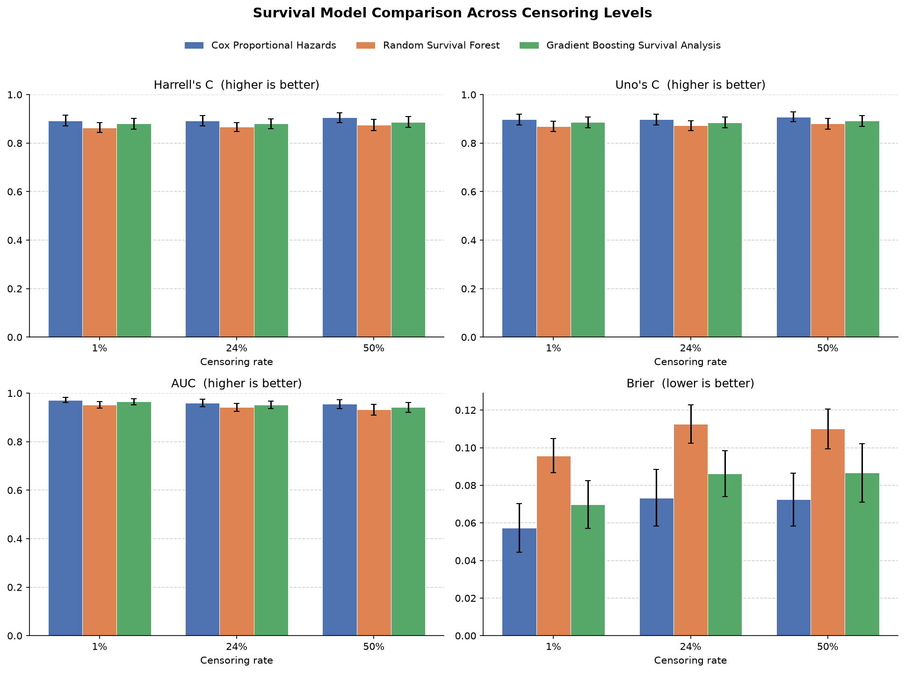
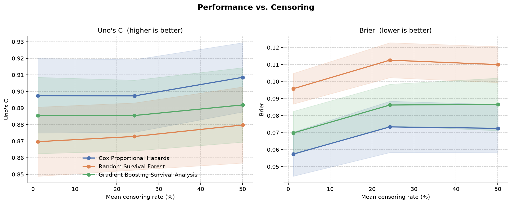

# Survival Model Simulation

A reproducible simulation study comparing three survival models — **Cox Proportional Hazards (CoxPH)**, **Random Survival Forest (RSF)**, and **Gradient Boosting Survival Analysis (GBSA)** — under increasing levels of right-censoring.

The project generates synthetic survival data with controllable censoring, fits each model across repeated trials, and evaluates them with concordance, time-dependent AUC, and the integrated Brier score. It is inspired by the [scikit-survival guide on evaluating survival models](https://scikit-survival.readthedocs.io/en/stable/user_guide/evaluating-survival-models.html), extended to compare multiple models, add IPCW-corrected metrics, control the censoring rate directly, and visualize how performance degrades as censoring grows.

## Methods

**Data.** Survival times are drawn from an exponential model whose hazard depends on uniformly sampled covariates (following Bender et al., 2005). Right-censoring is introduced by numerically solving for the censoring distribution that yields a target rate (0%, 25%, 50%), with a convergence check so failed trials are skipped.

**Models.** CoxPH (linear baseline), RSF (non-linear, ensemble of survival trees), and GBSA (gradient-boosted survival).

**Evaluation.** Each dataset is split 70/30 into train and test (stratified on the event indicator), models are fit on the training split, and all metrics are computed on the held-out test split — using the training split as the censoring reference for the IPCW-based metrics. Results are averaged over repeated trials per censoring level.

**Metrics.**

| Metric | Measures | Notes |
|---|---|---|
| Harrell's C | Rank concordance | Ignores the censoring distribution |
| Uno's C | Rank concordance | IPCW-corrected; robust under heavy censoring |
| Time-dependent AUC | Discrimination over time | Mean across the evaluation horizon |
| Integrated Brier Score | Calibration + discrimination | **Lower is better** |

`Actual C` and `Baseline AUC` are oracle values from the ground-truth risk scores, included as an upper reference.

## Results

### Model comparison



All three models reach similar concordance, but on held-out data **CoxPH leads on the integrated Brier score and time-dependent AUC** at every censoring level, while RSF is weakest. The data is generated from a proportional-hazards process, so the correctly-specified Cox model is hard to beat out of sample — the flexible tree ensembles gain nothing and pay an overfitting penalty, most visibly in calibration (Brier).

### Performance vs. censoring



The Brier score makes the degradation clearest: prediction error rises with censoring for every model, and **CoxPH stays best throughout** while RSF degrades fastest.

**Takeaway.** Because evaluation is fully out of sample, the comparison rewards the model that matches the data-generating process rather than the most flexible one — a concrete illustration of why held-out evaluation matters when comparing survival models.

## Repository structure

```
SurvivalSimulation/
├── README.md
├── requirements.txt
├── src/
│   ├── data_generation.py   # simulate survival data with controllable censoring
│   ├── models.py            # define CoxPH, RSF, GBSA
│   ├── evaluation.py        # compute the evaluation metrics
│   ├── simulation.py        # run the experiment loop and aggregate results
│   └── plotting.py          # produce the comparison figures
├── notebooks/
│   └── survival_simulation_demo.ipynb
└── results/
    └── figures/
        ├── model_comparison.png
        └── censoring_performance.png
```

## Running it

```bash
pip install -r requirements.txt
jupyter lab notebooks/survival_simulation_demo.ipynb
```

Or call the pipeline directly:

```python
from src.simulation import run_simulation
from src.plotting import plot_model_comparison, plot_censoring_performance

results = run_simulation(n_samples=500, m=3, n_repeats=50, random_state=42)
plot_model_comparison(results)
plot_censoring_performance(results)
```

The default demo run (`n_repeats=50`) takes a few minutes; lower `n_repeats` for a quick pass or raise it for smoother error bars.

## Reference

Bender, R., Augustin, T., & Blettner, M. (2005). Generating survival times to simulate Cox proportional hazards models. *Statistics in Medicine*, 24(11), 1713–1723.